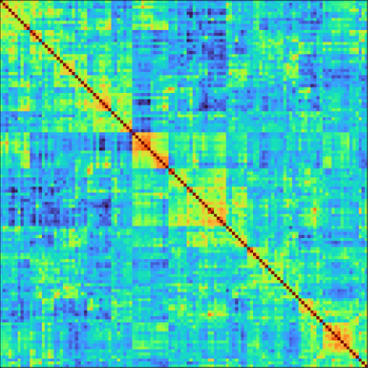

# Machine Learning in Neuroimaging

This tutorial introduces machine learning applied to functional MRI data, with hands-on exercises using [nilearn](https://nilearn.github.io). It covers functional connectivity, predictive modelling, and interpretation of ML results in a neuroimaging context.

## Contents

- **Functional connectivity with nilearn** — computing and visualizing connectomes from fMRI data
- **Machine learning with nilearn** — building and evaluating predictive models
- **Exercises: ADHD classification** — applying the methods to a real research question

## Dataset

The tutorial uses the **NeuroDev** dataset — a developmental functional MRI dataset preprocessed and packaged by **Elizabeth Dupre** specifically for this tutorial. This dataset has since been integrated as one of the main tutorial datasets in nilearn itself.

## History and acknowledgments

This tutorial has grown through several iterations and owes its existence to a wide community of contributors.

| Year | Event | Instructors |
|------|-------|-------------|
| 2020 | [Brainhack School](https://school-brainhack.github.io/modules/machine_learning_neuroimaging/) | **Jacob Vogel** — original lecture developed for **Jean-Baptiste Poline**'s course QLSC 612 at McGill University |
| 2022 | [MAIN Educational Workshop](https://past-main-educational.github.io/2022/material.html#machine-learning-in-functional-mri-using-nilearn) | **Hao-Ting Wang** and **Yasmin Mzayek** — Montreal Artificial Intelligence and Neuroscience (MAIN) conference |
| 2024 | [MAIN Educational Workshop](https://past-main-educational.github.io/2024/program/#machine-learning-in-functional-mri-using-nilearn) | **Hao-Ting Wang** and **Himanshu Aggarwal** — MAIN conference |
| 2026 | PSY3019 — Université de Montréal | Material adapted for an undergraduate psychology course by **Lune Bellec** |

We are grateful to all instructors, teaching assistants, and students who contributed feedback and improvements across these iterations.

## License

This material is shared under the terms of the [LICENSE](LICENSE) file in this repository.
